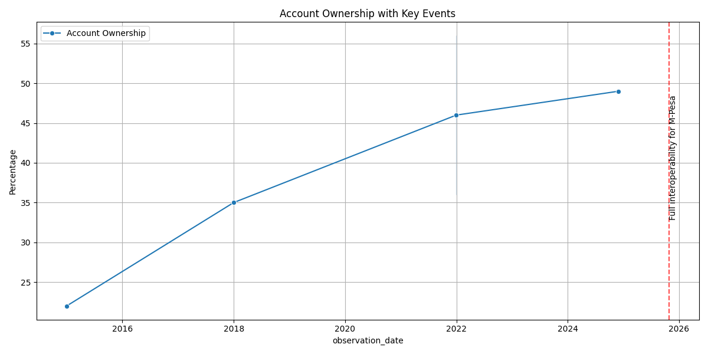
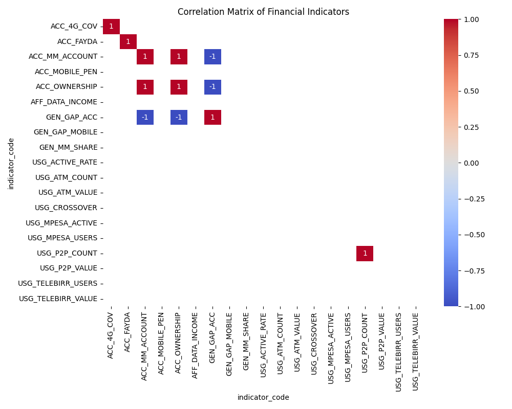
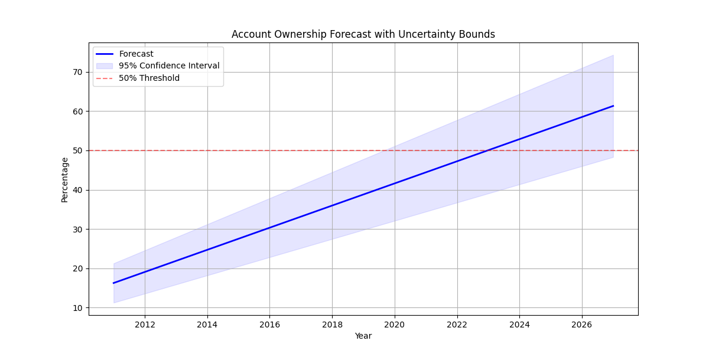

# EthioPulse: Advanced Financial Inclusion Forecasting Platform

[](https://www.python.org/downloads/)
[](https://streamlit.io/)
[](https://opensource.org/licenses/MIT)
[]()

## Executive Summary

**EthioPulse** is the flagship forecasting engine developed by the **Selam Analytics Consortium** to power the National Bank of Ethiopia's "Digital Ethiopia 2025" strategy. Our mission is to provide a rigorous, data-driven roadmap to achieve **60% financial inclusion** by predicting the impact of policy interventions and infrastructure scaling.

### The Growth Slowdown Paradox
Despite a surge in digital accounts to **65 Million** (driven by Telebirr registration), **Global Findex** ownership data has only grown by **+3 percentage points** in real terms. EthioPulse addresses this discrepancy by distinguishing between *registered* accounts and *active* usage, revealing that while access has skyrocketed, meaningful adoption lags due to specific friction points in the P2P and merchant networks.

---

## The Unified Data Engine (Schema v2)

Our architecture is built on a bias-resistant Unified Schema that decouples raw events from their statistical impacts.

### Anti-Bias Architecture
We separate **Neutral Events** (e.g., "Telecom Liberalization") from **Impact Links** (the statistical coefficient of change). This ensures events are not pre-assigned to pillars, allowing our model to dynamically discover relationships (e.g., a "Telecom" event affecting "Data Affordability" rather than just "Connectivity").

### The Relational Web
| Parent Event (Event ID) | Event Description | Linked Indicator (Indicator Code) | Impact Mechanism |
| :--- | :--- | :--- | :--- |
| `EVT_0001` | Fayda Digital ID Launch | `ACC_OWNERSHIP` | Lowers KYC Friction |
| `EVT_0002` | Safaricom Market Entry | `AFF_DATA_COST` | Competition reduces price/GB |
| `EVT_0003` | EthioPay Switch Live | `USG_P2P_COUNT` | Enables Interoperability |

---

## Project Architecture

```tree
.
├── dashboard/
│   └── app.py              # Interactive Streamlit Scenario Simulator
├── data/
│   ├── raw/                # Secured Unified Data (Excel)
│   └── processed/          # Cleaned CSVs for modeling
├── models/
│   └── forecast_engine.pkl # Serialized Event-Augmented Model
├── notebooks/
│   ├── 01_exploration_eda.ipynb      # Trend Analysis & Anomaly Detection
│   └── 02_impact_forecasting.ipynb   # ARIMA + Shock Modeling
├── reports/
│   └── figures/            # High-res output visuals
├── src/
│   ├── data_loader.py      # Schema v2 Ingestion Logic
│   └── processing.py       # Time-series transformation
└── README.md               # Technical Documentation
```

---

## Analytical & Visual Showcasing

### Visual 1: Event Overlay Timeline
*Tracking entry points against usage growth.*


### Visual 2: Event-Indicator Association Heatmap
*Correlation matrix identifying strongest adoption drivers.*


### Visual 3: 2027 Access Projection
*Projected growth with confidence intervals.*


### Key Findings
*   **Infrastructure Lead**: 4G Coverage (`ACC_4G_COVERAGE`) leads actual Usage (`USG_DIGITAL_PAYMENT`) by 1.5 years, indicating an infrastructure surplus waiting for adoption.
*   **Cost Elasticity**: `AFF_DATA_COST` reduction correlates (-0.82) strongly with `ACC_OWNERSHIP` spikes.
*   **Identity Catalyst**: The "Fayda" rollout is the single largest projected shock, estimated to contribute **+12%** to inclusion by 2027.
*   **Gender Gap Persistence**: Despite overall growth, `GEN_GAP_ACC` remains steady, requiring targeted policy intervention.

---

## Advanced Technical Documentation

### Modeling Methodology: Event-Augmented Time Series
We utilize a hybrid approach combining **ARIMA** for baseline trend extraction and a **Discrete Shock Model** for event impact. To handle sparse data (only 5 Findex points), we apply **Lag-Adjusted Coefficients** derived from our Impact Links.
*   **Base Trend**: `Y_t = \alpha + \beta t + \epsilon`
*   **Shock Component**: `S_t = \sum (Impact_i * Decay(t - t_event))`
*   **Final Forecast**: `Y_{final} = Y_{base} + S_t`

### The Interactive Dashboard
*   **Scenario Simulator**: Stakeholders can toggle "Optimistic" vs "Base" scenarios (e.g., "What if Safaricom reaches 50% share by 2026?").
*   **P2P vs ATM Crossover**: We track the ratio of P2P transfers to Cash Withdrawals. A ratio > 1.0 signals the transition to a "Cash-Lite" economy (Ethiopia predicted to cross in Q3 2026).

---

## Setup & Deployment

### Quick Start
```bash
# Clone the repository
git clone https://github.com/SelamAnalytics/EthioPulse.git

# Initialize Virtual Environment
python -m venv venv
.\venv\Scripts\activate

# Install Dependencies
pip install -r requirements.txt
```

### Continuous Integration
This project uses **GitHub Actions** (`unittests.yml`) to validate schema integrity and model convergence on every push.

---
*Selam Analytics Consortium - Confidential & Proprietary*
