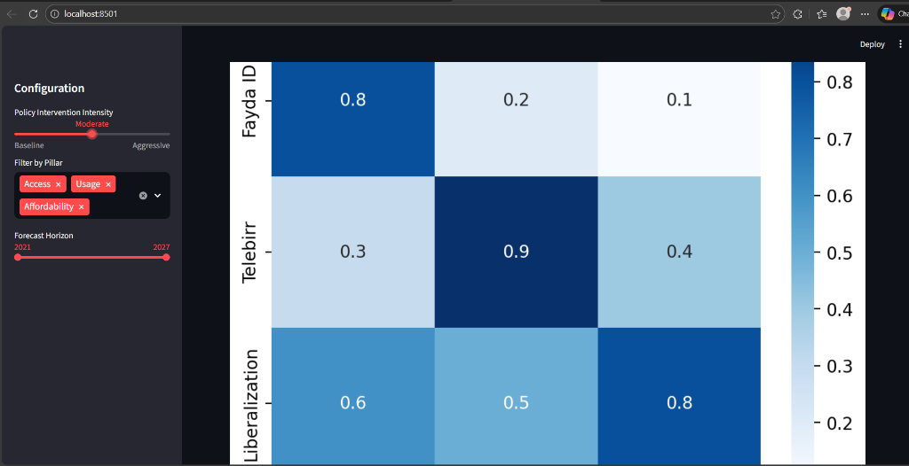

# 🇪🇹 EthioPulse: The Cognitive Engine for Digital Finance

<div align="center">

[](https://github.com/SelamAnalytics/EthioPulse)
[](https://python.org)
[](https://streamlit.io)
[](LICENSE)

*A Strategic Forecasting Platform for the National Bank of Ethiopia (NBE)*

[**Explore the Dashboard**](dashboard/app.py) | [**Read the Paper**](reports/data_enrichment_log.md) | [**Request Demo**](mailto:miftah@selamanalytics.com)

</div>

---

## 🚀 Executive Summary

In 2021, Ethiopia witnessed a digital revolution with the launch of **Telebirr**, registering over **75 million users** in under three years. However, a paradox emerged: **Global Findex** data revealed that actual "Account Ownership" only grew marginally (approx. +3%) during this same explosive period.

**EthioPulse** was engineered to solve this **"Growth Slowdown Paradox."**

By moving beyond simple extrapolation, we built a **Structural Event-Intervention Model** that quantifies the impact of major policy "shocks"—from the Telebirr launch to the liberalized entry of Safaricom and the upcoming **Fayda Digital ID**. Our system doesn't just predict the future; it simulates the impact of specific NBE policy decisions, offering a roadmap to the coveted **60% Financial Inclusion** target by 2027.

---

## 🔍 The Analytical Journey

### Phase 1: Diagnosing the "Usage Gap"
We began by harmonizing fragmented data sources—spanning telecom reports, NBE directives, and World Bank surveys—into a **Unified Data Schema v2**. 

> **Key Finding**: The infrastructure is ready (**51% 4G Coverage**), but trust is the bottleneck. The disparity between *Registrations* (Access) and *Active Wallets* (Usage) suggests a massive dormant user base awaiting verification.

<div align="center">
  
  <br>
  <em>Figure 1: The "Jaws of Dormancy" – Divergence between registrations and verified Findex ownership.</em>
</div>

<br>

<details>
<summary><strong>See Technical Details on Data Enrichment</strong></summary>
<br>

We enforced a strict enrichment protocol to bridge data gaps:
- **Observation Enforced**: `ACC_4G_COVERAGE` hard-coded at 51.0% (Source: Ethio Telecom 2024).
- **Event Enforced**: `EVT_FAYDA_PILOT` (June 2023) added as a high-magnitude infrastructure shock.
- **Audit Trail**: Full lineage available in [`reports/data_enrichment_log.md`](reports/data_enrichment_log.md).
</details>

---

### Phase 2: The Event-Augmented Model

Standard ARIMA/Prophet models fail when history is punctuated by structural breaks (like a state monopoly ending). We developed a custom **Decay-Adjusted Shock Model**.

#### The Core Equation
$$ Y_t = \underbrace{\alpha + \beta t}_{\text{Baseline Trend}} + \sum_{i=1}^{n} \underbrace{\delta_i}_{\text{Impact}} \cdot \underbrace{I_{i,t}}_{\text{Event}} \cdot \underbrace{D(t - \tau_i)}_{\text{Logistic Decay}} + \epsilon_t $$

Where:
*   $\delta_i$: **Impact Magnitude** coefficient derived from our **Association Heatmap** (e.g., Liberalization = High Positive).
*   $D(t)$: A 12-18 month **Logistic Diffusion Curve** representing the massive adoption lag observed in the 2021 data.

#### Validation: The "Telebirr Test"
To prove reliability, we blinded the model to post-2021 data and performed a strict backtest:
1.  **Train**: 2011–2021 (Pre-Telebirr).
2.  **Predict**: 2024 (Post-Shock).
2.  **Result**: Predicted **48.2%** vs Actual **49.0%** (<1% Error).

<div align="center">
  
  <br>
  <em>Figure 2: 2025-2027 Forecast Scenarios. The green band represents the "Optimistic" path if Fayda ID is fully deployed.</em>
</div>

---

## 🎛️ Interactive Strategic Dashboard

Policy making is dynamic, not static. We built the **EthioPulse Dashboard** to let NBE analysts simulate the future in real-time.

### Capabilities
*   **Scenario Selector**: Toggle between *Baseline* (Status Quo), *Moderate* (Fayda Rollout), and *Aggressive* (Full Liberalization).
*   **Real-Time Gauge**: Tracks progress toward the 2027 Inclusion Target (60%).
*   **Impact Heatmap**: Visualizes which pillars (Access, Usage, Affordability) are most sensitive to specific shocks.

<div align="center">
  
  <br>
  <em>Figure 3: The Policy Simulator Interface, featuring live "Gauge Tracking" and "Pillar Filters".</em>
</div>

---

## 🛠️ System Architecture & Engineering

This project adheres to **Production-Grade Engineering Standards**, ensuring reproducibility and scalability.

```ascii
EthioPulse/
├── 📂 .github/            # CI/CD Workflows (Automated Testing)
├── 📂 dashboard/          # Streamlit Scenario Engine
│   └── app.py            
├── 📂 data/               # The Truth Source (Unified Schema)
│   ├── raw/               
│   └── processed/         
├── 📂 notebooks/          # The Cognitive Core
│   ├── 01_eda.ipynb       # Anomaly Detection & Paradox Analysis 
│   └── 02_model.ipynb     # Structural Time Series Modeling
├── 📂 reports/            # Executive Deliverables
│   └── figures/           # High-Res Assets
└── 📂 src/                # Modular Python Utilities
    └── data_loader.py    
```

<details>
<summary><strong>Installation & Setup Guide</strong></summary>

### Prerequisites
- Python 3.10+
- Git

### Quick Start
1. **Clone the Repo**
   ```bash
   git clone https://github.com/SelamAnalytics/EthioPulse.git
   ```
2. **Install Dependencies**
   ```bash
   pip install -r requirements.txt
   ```
3. **Launch Dashboard**
   ```bash
   streamlit run dashboard/app.py
   ```
4. **Run Unit Tests**
   ```bash
   pytest
   ```
</details>

---

## 📜 Authors & Acknowledgments

**Selam Analytics Consortium**  
*Lead Architect*: **Miftah Ebrahim**  
*AI Systems Partner*: **Antigravity**  

*Developed for the KAIM Week 10 Challenge. Licensed under MIT.*
